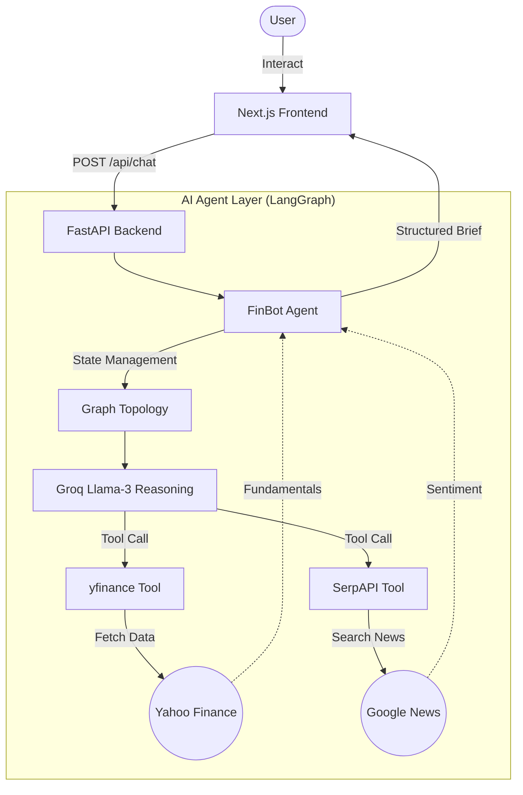

# FinBot 📈🤖

An AI-powered equity research analyst chatbot that provides structured, data-driven analysis of publicly traded companies. This project uses **LangGraph**, **FastAPI**, and **Next.js** to evaluate financial information, perform valuations, and analyze news sentiment, delivering actionable insights without making speculative predictions.

---

## 🏗️ Architecture

FinBot follows a modern decoupled architecture where the frontend interacts with a Python-based FastAPI backend that orchestrates a LangGraph agent.



---

## ✨ Features

- **📊 Stock Fundamentals Analysis**: Pulls live data such as Price, P/E ratio, Market Cap, and Revenue Growth using Yahoo Finance (`yfinance`).
- **📰 News Sentiment**: Evaluates recent news on a given ticker/company via Google News (SerpAPI) to gauge market sentiment (Bullish, Neutral, Bearish).
- **🧠 Advanced Reasoning**: Built on LangChain and LangGraph utilizing Groq's low-latency inference for structured output.
- **⚡ Modern UI**: Beautiful, responsive chat interface built with Next.js 16, React 19, Tailwind CSS v4, and Shadcn UI.
- **🛡️ Structured Analyst Briefs**: Delivers analysis formatted neatly into Fundamentals, Valuation Signals, News Sentiment, Key Risks, and an Outlook summary.

---

## 📂 Project Structure

```text
finbot/
├── app/                  # Backend FastAPI Application
│   ├── agent.py          # LangGraph Agent Definition & System Prompt
│   ├── api.py            # FastAPI Routes & Middleware
│   ├── config.py         # Environment & Settings Management
│   └── tools.py          # Custom Tools (yfinance, SerpAPI)
├── frontend/             # Next.js Application
│   ├── src/
│   │   ├── app/          # Next.js App Router (UI Components)
│   │   └── lib/          # Utilities & API Client
│   ├── tailwind.config.ts # Tailwind CSS v4 Configuration
│   └── package.json      # Frontend Dependencies
├── .env                  # Environment Variables (Secrets)
├── .gitignore            # Git Ignore Rules
├── pyproject.toml        # Backend Dependencies & Project Metadata
└── README.md             # Project Documentation
```

---

## 🚀 Getting Started

### Prerequisites

You need API keys for the following services to run the backend agents:
- **Groq API Key**: For fast LLM inference. Get it from [Groq Cloud](https://console.groq.com/).
- **SerpAPI Key**: To fetch Google News for sentiment analysis. Get it from [SerpAPI](https://serpapi.com/).

### 1. Backend Setup

From the root `finbot` directory, install requirements and start the server.

```bash
# 1. Configure Environment Variables
# Create a .env file with your keys
GROQ_API_KEY=gsk_xxx
SERPAPI_API_KEY=xxx

# 2. Install dependencies (using uv or pip)
uv sync # OR pip install -r requirements.txt

# 3. Start the FastAPI server
uvicorn app.api:app --reload --port 8000
```

### 2. Frontend Setup

In a new terminal, navigate to the `frontend` folder.

```bash
cd frontend
npm install
npm run dev
```

Visit `http://localhost:3000` to start using FinBot.

---

## 🔌 API Reference

### `POST /api/chat`

Handles chat interactions with the FinBot agent.

**Request Body:**
```json
{
  "messages": [
    { "role": "user", "content": "Analyze NVIDIA stock." }
  ]
}
```

**Response Body:**
```json
{
  "message": "**NVDA — Analyst Brief**\n- 📊 **Fundamentals:** price $x, P/E y, market cap z..."
}
```

---

## ⚖️ Analyst Rules & Ethics

FinBot follows a strict system prompt to ensure objectivity:
1. **No Speculation**: It never provides "Buy" or "Sell" ratings.
2. **Data First**: It must query tools before providing numbers; it never relies on internal knowledge for live stock metrics.
3. **Structured Output**: Analysis is always broken down into five key sections for readability.

---

## 📄 License

Distributed under the MIT License. See `LICENSE` for more information.
